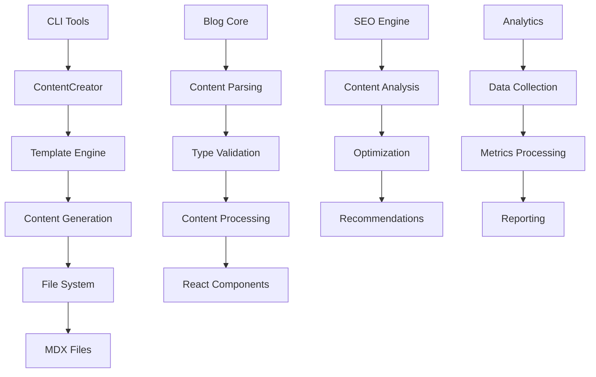

# Developer Guide

**Technical documentation for extending, customizing, and maintaining the
CueTimer Blog Management System**

---

## 🎯 Overview

This guide provides comprehensive technical documentation for developers working
with the CueTimer Blog Management System. It covers system architecture, code
organization, template development, CLI tool patterns, testing strategies, and
extension mechanisms.

## 🏗️ System Architecture

### Core Components

```
cue-timer/
├── lib/
│   ├── blog.ts                    # Core blog functionality
│   ├── blog-utils.ts             # Utility functions
│   └── blog-scripts/
│       ├── content-creator.ts     # Content generation engine
│       ├── types.ts              # TypeScript type definitions
│       └── templates/            # Content templates
│           ├── timing-guide.ts   # Timing guide template
│           ├── case-study.ts     # Case study template
│           ├── feature-announce.ts # Feature announcement template
│           └── presentation-tips.ts # Presentation tips template
├── scripts/
│   ├── blog-create.ts            # Content creation CLI
│   ├── blog-publish.ts           # Publishing workflow CLI
│   ├── blog-analytics.ts         # Analytics CLI
│   ├── blog-seo-check.ts         # SEO optimization CLI
│   └── blog-workflow-status.ts   # Workflow management CLI
├── components/blog/              # React components
├── types/                        # Type definitions
└── tests/                        # Test suites
```

### Data Flow Architecture



### Core Type System

#### Blog Content Types

```typescript
// Primary blog post interface
interface BlogPost {
  title: string;
  slug: string;
  category: BlogCategory;
  summary: string;
  author: string;
  publishedAt: string;
  readTime: number;
  language: string;
  tags?: string[];
  isDraft: boolean;
  content?: string;
  lastModified?: string;
  image?: string;
  difficulty?: string;
}

// Enhanced blog post with additional metadata
interface BlogPostEnhanced extends BlogPost {
  excerpt: string;
  wordCount: number;
  publishedAtDate: Date;
  lastModifiedDate?: Date;
  locale: string;
  imageAlt?: string;
  featured: boolean;
  draft: boolean;
  seo?: SEOData;
}
```

#### Template System Types

```typescript
// Template definition interface
interface CueTimerTemplate {
  id: string;
  name: string;
  category: BlogCategory;
  languages: string[];
  variables: TemplateVariable[];
  contentStructure: ContentSection[];
}

// Template variable definition
interface TemplateVariable {
  name: string;
  type: 'string' | 'number' | 'boolean' | 'array';
  required: boolean;
  description: string;
  defaultValue?: any;
  validation?: VariableValidation;
}

// Content structure definition
interface ContentSection {
  id: string;
  title: string;
  type: 'heading' | 'paragraph' | 'code' | 'list' | 'image';
  required: boolean;
  order: number;
  template?: string;
}
```

#### Multi-Language Types

```typescript
// Multi-language post management
interface MultiLanguagePost {
  masterPost: BlogPost;
  translations: Map<string, BlogPost>;
  workflowState:
    | 'draft'
    | 'in-translation'
    | 'in-review'
    | 'scheduled'
    | 'published';
  synchronizationStatus: SyncStatus;
}

// Synchronization status tracking
interface SyncStatus {
  isMaster: boolean;
  lastSynced: Date;
  pendingTranslations: string[];
  inconsistentFields: string[];
}
```

---

## 🔧 Core Classes and APIs

### ContentCreator Class

The ContentCreator class is the heart of the content generation system:

```typescript
export class ContentCreator {
  private contentDir: string;
  private templatesDir: string;
  private validator: ContentValidator;
  private serializer: ContentSerializer;

  constructor(options?: ContentCreatorOptions) {
    this.contentDir =
      options?.contentDir || join(process.cwd(), 'content', 'blog');
    this.templatesDir = options?.templatesDir || join(__dirname, 'templates');
    this.validator = new ContentValidator();
    this.serializer = new ContentSerializer();
  }

  // Create new blog post from template
  async createPost(
    template: CueTimerTemplate,
    variables: Record<string, any>,
    language: string = 'en'
  ): Promise<BlogPost> {
    // Implementation details...
  }

  // Validate template variables
  private validateTemplateVariables(
    template: CueTimerTemplate,
    variables: Record<string, any>
  ): void {
    // Validation logic...
  }

  // Generate post data from template and variables
  private generatePostData(
    template: CueTimerTemplate,
    variables: Record<string, any>,
    language: string
  ): BlogPost {
    // Content generation logic...
  }

  // Serialize post to MDX format
  private serializePost(post: BlogPost): string {
    // Serialization logic...
  }
}
```

#### ContentCreator Usage Example

```typescript
import { ContentCreator } from '@/lib/blog-scripts/content-creator';
import TIMING_GUIDE_TEMPLATE from '@/lib/blog-scripts/templates/timing-guide';

// Initialize content creator
const creator = new ContentCreator({
  contentDir: './custom-content',
  templatesDir: './custom-templates',
});

// Create content
const variables = {
  title: 'Advanced Timing Techniques',
  targetAudience: 'Professional speakers',
  difficultyLevel: 'advanced',
  estimatedTime: 45,
  introduction: 'Master advanced timing techniques...',
  steps: [
    {
      title: 'Preparation',
      description: 'Set up your timing environment',
      timeAllocation: 15,
      tips: ['Test equipment beforehand'],
    },
  ],
};

const post = await creator.createPost(TIMING_GUIDE_TEMPLATE, variables, 'en');

console.log(`Created post: ${post.slug}`);
```

### Content Validator

```typescript
export class ContentValidator {
  // Validate blog post data
  validatePost(post: BlogPost): ValidationResult {
    const errors: ValidationError[] = [];

    // Required field validation
    if (!post.title || post.title.trim().length === 0) {
      errors.push({ field: 'title', message: 'Title is required' });
    }

    // SEO validation
    if (post.title && post.title.length > 60) {
      errors.push({
        field: 'title',
        message: 'Title should be 60 characters or less for optimal SEO',
      });
    }

    return { isValid: errors.length === 0, errors };
  }

  // Validate template variables
  validateTemplateVariables(
    template: CueTimerTemplate,
    variables: Record<string, any>
  ): ValidationResult {
    // Template-specific validation logic...
  }

  // Validate content structure
  validateContentStructure(
    content: string,
    structure: ContentSection[]
  ): ValidationResult {
    // Content structure validation logic...
  }
}
```

### Content Serializer

```typescript
export class ContentSerializer {
  // Serialize blog post to MDX format
  serialize(post: BlogPost): string {
    const frontmatter = this.generateFrontmatter(post);
    const content = post.content || '';

    return `---\n${frontmatter}\n---\n\n${content}`;
  }

  // Parse MDX content to blog post
  deserialize(mdxContent: string): BlogPost {
    const { data, content } = matter(mdxContent);

    return {
      ...data,
      content,
      // Additional processing...
    };
  }

  // Generate frontmatter from post data
  private generateFrontmatter(post: BlogPost): string {
    const frontmatter: Record<string, any> = {
      title: post.title,
      slug: post.slug,
      category: post.category,
      summary: post.summary,
      author: post.author,
      publishedAt: post.publishedAt,
      readTime: post.readTime,
      language: post.language,
      draft: post.isDraft,
    };

    // Add optional fields
    if (post.tags) frontmatter.tags = post.tags;
    if (post.image) frontmatter.image = post.image;
    if (post.difficulty) frontmatter.difficulty = post.difficulty;

    return Object.entries(frontmatter)
      .map(([key, value]) => `${key}: ${JSON.stringify(value)}`)
      .join('\n');
  }
}
```

---

## 📝 Template Development

### Creating Custom Templates

#### Template Structure

Each template follows a consistent structure:

```typescript
// custom-template.ts
import { CueTimerTemplate } from './types';

export const CUSTOM_TEMPLATE: CueTimerTemplate = {
  id: 'custom-template',
  name: 'Custom Content Type',
  category: 'custom-category',
  languages: ['en', 'pt-br', 'es'],

  variables: [
    {
      name: 'title',
      type: 'string',
      required: true,
      description: 'Content title',
    },
    {
      name: 'mainContent',
      type: 'string',
      required: true,
      description: 'Main content section',
    },
    {
      name: 'examples',
      type: 'array',
      required: false,
      description: 'Examples array',
      defaultValue: [],
    },
  ],

  contentStructure: [
    {
      id: 'introduction',
      title: 'Introduction',
      type: 'paragraph',
      required: true,
      order: 1,
    },
    {
      id: 'main-content',
      title: 'Main Content',
      type: 'paragraph',
      required: true,
      order: 2,
    },
    {
      id: 'examples',
      title: 'Examples',
      type: 'list',
      required: false,
      order: 3,
    },
  ],
};

// Variable types for type safety
export interface CustomTemplateVariables {
  title: string;
  mainContent: string;
  examples?: string[];
  author?: string;
  tags?: string[];
}

// Template-specific content generator
export function generateCustomContent(
  variables: CustomTemplateVariables,
  language: string = 'en'
): string {
  const { title, mainContent, examples = [] } = variables;

  let content = `# ${title}\n\n`;
  content += `${mainContent}\n\n`;

  if (examples.length > 0) {
    content += '## Examples\n\n';
    examples.forEach((example) => {
      content += `- ${example}\n`;
    });
  }

  return content;
}
```

#### Advanced Template Features

##### Conditional Content

```typescript
export function generateConditionalContent(
  variables: CustomTemplateVariables,
  language: string
): string {
  let content = '';

  // Language-specific content
  if (language === 'pt-br') {
    content += '## Conteúdo em Português\n\n';
  } else if (language === 'es') {
    content += '## Contenido en Español\n\n';
  } else {
    content += '## English Content\n\n';
  }

  // Conditional sections
  if (variables.examples && variables.examples.length > 0) {
    content += generateExamplesSection(variables.examples);
  }

  return content;
}
```

##### Dynamic Content Generation

```typescript
export function generateDynamicContent(
  variables: CustomTemplateVariables,
  context: GenerationContext
): string {
  const content = [];

  // Time-based content
  const currentDate = new Date();
  if (currentDate.getMonth() >= 10 && currentDate.getMonth() <= 12) {
    content.push('## Conference Season Tips\n\n');
  }

  // Audience-specific content
  if (context.audience === 'enterprise') {
    content.push('### Enterprise Considerations\n\n');
  }

  return content.join('\n');
}
```

### Template Registration

#### Registering New Templates

```typescript
// In your main blog configuration
import { CUSTOM_TEMPLATE } from './templates/custom-template';

// Template registry
const TEMPLATE_REGISTRY = {
  'timing-guide': TIMING_GUIDE_TEMPLATE,
  'case-study': CASE_STUDY_TEMPLATE,
  'feature-announce': FEATURE_ANNOUNCE_TEMPLATE,
  'presentation-tips': PRESENTATION_TIPS_TEMPLATE,
  'custom-template': CUSTOM_TEMPLATE, // Add your custom template
};

// Template generator registry
const TEMPLATE_GENERATORS = {
  'timing-guide': generateTimingGuideContent,
  'case-study': generateCaseStudyContent,
  'feature-announce': generateFeatureAnnounceContent,
  'presentation-tips': generatePresentationTipsContent,
  'custom-template': generateCustomContent, // Add your generator
};
```

#### Dynamic Template Loading

```typescript
export class TemplateLoader {
  private templates: Map<string, CueTimerTemplate> = new Map();
  private generators: Map<string, ContentGenerator> = new Map();

  // Load templates from directory
  async loadTemplatesFromDirectory(directory: string): Promise<void> {
    const templateFiles = await fs.readdir(directory);

    for (const file of templateFiles) {
      if (file.endsWith('.ts')) {
        const templateModule = await import(join(directory, file));

        if (templateModule.template) {
          this.templates.set(
            templateModule.template.id,
            templateModule.template
          );
        }

        if (templateModule.generateContent) {
          this.generators.set(
            templateModule.template.id,
            templateModule.generateContent
          );
        }
      }
    }
  }

  // Get template by ID
  getTemplate(id: string): CueTimerTemplate | undefined {
    return this.templates.get(id);
  }

  // Get content generator
  getGenerator(id: string): ContentGenerator | undefined {
    return this.generators.get(id);
  }
}
```

---

## 🛠️ CLI Tool Development

### CLI Tool Structure

Each CLI tool follows a consistent structure:

```typescript
// custom-cli-tool.ts
#!/usr/bin/env bun

import { Command } from 'commander';
import chalk from 'chalk';
import ora from 'ora';
import inquirer from 'inquirer';

// Import necessary modules
import { ContentCreator } from '../lib/blog-scripts/content-creator';
import { validateInputs } from '../lib/validators';

// CLI options interface
interface CliOptions {
  input?: string;
  output?: string;
  template?: string;
  interactive?: boolean;
  verbose?: boolean;
}

// Main CLI function
async function main(): Promise<void> {
  const program = new Command();

  program
    .name('custom-tool')
    .description('Custom CLI tool for specific functionality')
    .version('1.0.0');

  // Add command options
  program
    .option('-i, --input <path>', 'Input file path')
    .option('-o, --output <path>', 'Output directory')
    .option('-t, --template <name>', 'Template to use')
    .option('--interactive', 'Interactive mode')
    .option('--verbose', 'Verbose output')
    .action(async (options: CliOptions) => {
      try {
        await executeCommand(options);
      } catch (error) {
        console.error(chalk.red('Error:'), error.message);
        process.exit(1);
      }
    });

  await program.parseAsync(process.argv);
}

// Command execution logic
async function executeCommand(options: CliOptions): Promise<void> {
  const spinner = ora('Processing...').start();

  try {
    // Validate inputs
    const validation = validateInputs(options);
    if (!validation.isValid) {
      spinner.fail('Input validation failed');
      console.error(chalk.red('Validation errors:'));
      validation.errors.forEach(error => {
        console.error(`  - ${error.field}: ${error.message}`);
      });
      return;
    }

    // Interactive mode
    if (options.interactive) {
      const answers = await promptForMissingOptions(options);
      Object.assign(options, answers);
    }

    // Execute main logic
    const result = await processRequest(options);

    spinner.succeed('Operation completed successfully');

    if (options.verbose) {
      console.log(chalk.blue('Result:'), result);
    }

  } catch (error) {
    spinner.fail('Operation failed');
    throw error;
  }
}

// Interactive prompts
async function promptForMissingOptions(options: CliOptions): Promise<Partial<CliOptions>> {
  const questions = [];

  if (!options.template) {
    questions.push({
      type: 'list',
      name: 'template',
      message: 'Select a template:',
      choices: [
        { name: 'Timing Guide', value: 'timing-guide' },
        { name: 'Case Study', value: 'case-study' },
        { name: 'Feature Announcement', value: 'feature-announce' },
        { name: 'Presentation Tips', value: 'presentation-tips' }
      ]
    });
  }

  if (!options.input) {
    questions.push({
      type: 'input',
      name: 'input',
      message: 'Enter input path:',
      validate: (input: string) => input.trim().length > 0 || 'Input path is required'
    });
  }

  return await inquirer.prompt(questions);
}

// Main processing logic
async function processRequest(options: CliOptions): Promise<any> {
  const contentCreator = new ContentCreator();

  // Your custom processing logic here
  const result = await contentCreator.processCustomRequest(options);

  return result;
}

// Error handling
process.on('uncaughtException', (error) => {
  console.error(chalk.red('Uncaught Exception:'), error.message);
  process.exit(1);
});

process.on('unhandledRejection', (reason, promise) => {
  console.error(chalk.red('Unhandled Rejection:'), reason);
  process.exit(1);
});

// Execute main function
if (import.meta.main) {
  main();
}
```

### CLI Tool Best Practices

#### Error Handling

```typescript
export class CLIError extends Error {
  constructor(
    message: string,
    public code?: string,
    public details?: any
  ) {
    super(message);
    this.name = 'CLIError';
  }
}

// Error handling middleware
export function handleCLIError(error: Error): void {
  if (error instanceof CLIError) {
    console.error(chalk.red(`Error (${error.code}):`), error.message);
    if (error.details) {
      console.error(chalk.yellow('Details:'), error.details);
    }
  } else {
    console.error(chalk.red('Unexpected error:'), error.message);
  }

  if (process.env.NODE_ENV === 'development') {
    console.error(chalk.gray(error.stack));
  }
}
```

#### Progress Indicators

```typescript
export class ProgressTracker {
  private spinners: Map<string, ora.Ora> = new Map();

  start(taskName: string, message: string): void {
    const spinner = ora(message).start();
    this.spinners.set(taskName, spinner);
  }

  succeed(taskName: string, message?: string): void {
    const spinner = this.spinners.get(taskName);
    if (spinner) {
      spinner.succeed(message);
      this.spinners.delete(taskName);
    }
  }

  fail(taskName: string, message?: string): void {
    const spinner = this.spinners.get(taskName);
    if (spinner) {
      spinner.fail(message);
      this.spinners.delete(taskName);
    }
  }

  update(taskName: string, message: string): void {
    const spinner = this.spinners.get(taskName);
    if (spinner) {
      spinner.text = message;
    }
  }
}
```

#### Configuration Management

```typescript
export interface CLIConfig {
  defaultTemplate?: string;
  outputDirectory?: string;
  language?: string;
  author?: string;
  apiKeys?: Record<string, string>;
  webhookUrls?: Record<string, string>;
}

export class ConfigManager {
  private config: CLIConfig = {};

  async loadConfig(): Promise<CLIConfig> {
    // Load from multiple sources in priority order
    const sources = [
      this.loadFromEnvironment(),
      this.loadFromConfigFile(),
      this.loadFromGlobalConfig(),
      this.getDefaultConfig(),
    ];

    for (const source of sources) {
      this.config = { ...this.config, ...(await source) };
    }

    return this.config;
  }

  private async loadFromEnvironment(): Promise<Partial<CLIConfig>> {
    return {
      language: process.env.CUETIMER_LANGUAGE,
      author: process.env.CUETIMER_AUTHOR,
      outputDirectory: process.env.CUETIMER_OUTPUT_DIR,
    };
  }

  private async loadFromConfigFile(): Promise<Partial<CLIConfig>> {
    const configPath = join(process.cwd(), 'cuetimer.config.json');

    if (
      await fs
        .access(configPath)
        .then(() => true)
        .catch(() => false)
    ) {
      const configContent = await fs.readFile(configPath, 'utf-8');
      return JSON.parse(configContent);
    }

    return {};
  }

  // Additional config loading methods...
}
```

---

## 🧪 Testing Strategies

### Unit Testing

#### Template Testing

```typescript
// tests/templates/timing-guide.test.ts
import { generateTimingGuideContent } from '@/lib/blog-scripts/templates/timing-guide';
import { TimingGuideVariables } from '@/lib/blog-scripts/templates/timing-guide';

describe('Timing Guide Template', () => {
  const mockVariables: TimingGuideVariables = {
    title: 'Test Timing Guide',
    targetAudience: 'Test Users',
    difficultyLevel: 'beginner',
    estimatedTime: 30,
    introduction: 'Test introduction',
    steps: [
      {
        title: 'Test Step',
        description: 'Test description',
        timeAllocation: 10,
        tips: ['Test tip'],
      },
    ],
  };

  test('generates content with correct structure', () => {
    const content = generateTimingGuideContent(mockVariables);

    expect(content).toContain('# Test Timing Guide');
    expect(content).toContain('## Target Audience');
    expect(content).toContain('Test Users');
    expect(content).toContain('## Step-by-Step Guide');
  });

  test('includes all required sections', () => {
    const content = generateTimingGuideContent(mockVariables);

    const requiredSections = [
      'Target Audience',
      'Prerequisites',
      'Step-by-Step Guide',
      'Best Practices',
    ];

    requiredSections.forEach((section) => {
      expect(content).toContain(`## ${section}`);
    });
  });

  test('handles optional sections gracefully', () => {
    const variablesWithoutOptional = {
      ...mockVariables,
      prerequisites: undefined,
      commonMistakes: undefined,
    };

    const content = generateTimingGuideContent(variablesWithoutOptional);

    expect(content).toContain('# Test Timing Guide');
    // Should not contain empty prerequisite sections
    expect(content).not.toContain('## Prerequisites\n\n');
  });
});
```

#### ContentCreator Testing

```typescript
// tests/content-creator.test.ts
import { ContentCreator } from '@/lib/blog-scripts/content-creator';
import { TIMING_GUIDE_TEMPLATE } from '@/lib/blog-scripts/templates/timing-guide';
import { tmpdir } from 'os';
import { join } from 'path';

describe('ContentCreator', () => {
  let contentCreator: ContentCreator;
  let tempDir: string;

  beforeEach(() => {
    tempDir = join(tmpdir(), 'test-content-' + Date.now());
    contentCreator = new ContentCreator({
      contentDir: tempDir,
    });
  });

  afterEach(async () => {
    await fs.rm(tempDir, { recursive: true, force: true });
  });

  test('creates blog post with correct structure', async () => {
    const variables = {
      title: 'Test Post',
      targetAudience: 'Developers',
      difficultyLevel: 'intermediate' as const,
      estimatedTime: 45,
    };

    const post = await contentCreator.createPost(
      TIMING_GUIDE_TEMPLATE,
      variables,
      'en'
    );

    expect(post.title).toBe('Test Post');
    expect(post.category).toBe('timing-guide');
    expect(post.language).toBe('en');
    expect(post.slug).toBe('test-post');
    expect(post.isDraft).toBe(true);
  });

  test('creates file in correct directory structure', async () => {
    const variables = {
      title: 'Test Post',
      targetAudience: 'Developers',
      difficultyLevel: 'intermediate' as const,
      estimatedTime: 45,
    };

    await contentCreator.createPost(TIMING_GUIDE_TEMPLATE, variables, 'en');

    const currentYear = new Date().getFullYear();
    const currentMonth = String(new Date().getMonth() + 1).padStart(2, '0');
    const expectedPath = join(
      tempDir,
      currentYear.toString(),
      currentMonth,
      'test-post.mdx'
    );

    expect(
      await fs
        .access(expectedPath)
        .then(() => true)
        .catch(() => false)
    ).toBe(true);
  });

  test('validates required variables', async () => {
    const invalidVariables = {
      // Missing required fields
      targetAudience: 'Developers',
    };

    await expect(
      contentCreator.createPost(TIMING_GUIDE_TEMPLATE, invalidVariables, 'en')
    ).rejects.toThrow('Required variable');
  });
});
```

### Integration Testing

#### CLI Integration Testing

```typescript
// tests/integration/cli-workflow.test.ts
import { execSync } from 'child_process';
import { join } from 'path';
import { tmpdir } from 'os';

describe('CLI Integration Tests', () => {
  let tempDir: string;

  beforeEach(() => {
    tempDir = join(tmpdir(), 'cli-test-' + Date.now());
    fs.mkdirSync(tempDir, { recursive: true });
  });

  afterEach(() => {
    fs.rmSync(tempDir, { recursive: true, force: true });
  });

  test('blog:create creates content with template', () => {
    const result = execSync(
      `bun run blog:create --template timing-guide --title "Integration Test" --author "Test Author"`,
      {
        cwd: tempDir,
        encoding: 'utf-8',
      }
    );

    expect(result).toContain('Created post:');
    expect(result).toContain('integration-test');

    // Verify file was created
    const contentPath = join(
      tempDir,
      'content',
      'blog',
      '2025',
      '01',
      'integration-test.mdx'
    );
    expect(fs.existsSync(contentPath)).toBe(true);
  });

  test('blog:seo-check analyzes content', () => {
    // Create test content first
    execSync(`bun run blog:create --template timing-guide --title "SEO Test"`, {
      cwd: tempDir,
    });

    // Run SEO check
    const result = execSync(
      'bun run blog:seo-check --directory content/blog --format json',
      {
        cwd: tempDir,
        encoding: 'utf-8',
      }
    );

    const seoReport = JSON.parse(result);
    expect(seoReport).toHaveProperty('overall_score');
    expect(seoReport).toHaveProperty('categories');
  });
});
```

### Performance Testing

#### Load Testing

```typescript
// tests/performance/content-creation.performance.test.ts
import { ContentCreator } from '@/lib/blog-scripts/content-creator';
import { TIMING_GUIDE_TEMPLATE } from '@/lib/blog-scripts/templates/timing-guide';

describe('ContentCreator Performance', () => {
  let contentCreator: ContentCreator;

  beforeEach(() => {
    contentCreator = new ContentCreator();
  });

  test('creates post within time limit', async () => {
    const variables = {
      title: 'Performance Test Post',
      targetAudience: 'Test Users',
      difficultyLevel: 'beginner' as const,
      estimatedTime: 30,
    };

    const startTime = Date.now();
    await contentCreator.createPost(TIMING_GUIDE_TEMPLATE, variables, 'en');
    const endTime = Date.now();

    const duration = endTime - startTime;
    expect(duration).toBeLessThan(2000); // Should complete within 2 seconds
  });

  test('handles concurrent post creation', async () => {
    const promises = [];

    for (let i = 0; i < 10; i++) {
      const variables = {
        title: `Concurrent Test Post ${i}`,
        targetAudience: 'Test Users',
        difficultyLevel: 'beginner' as const,
        estimatedTime: 30,
      };

      promises.push(
        contentCreator.createPost(TIMING_GUIDE_TEMPLATE, variables, 'en')
      );
    }

    const startTime = Date.now();
    const results = await Promise.all(promises);
    const endTime = Date.now();

    expect(results).toHaveLength(10);
    expect(endTime - startTime).toBeLessThan(10000); // Should complete within 10 seconds
  });
});
```

---

## 🔌 Extension Points and Plugins

### Plugin System Architecture

```typescript
// Plugin interface
export interface CueTimerPlugin {
  name: string;
  version: string;
  description: string;

  // Plugin lifecycle hooks
  onContentCreate?(context: ContentContext): Promise<void>;
  onContentUpdate?(context: ContentContext): Promise<void>;
  onContentPublish?(context: PublishContext): Promise<void>;

  // Template extension points
  templateVariables?(templateId: string): TemplateVariable[];
  contentGenerator?(templateId: string, variables: any): string;

  // CLI extension points
  cliCommands?(): Command[];

  // SEO extension points
  seoAnalyzers?(): SEOAnalyzer[];

  // Analytics extension points
  analyticsCollectors?(): AnalyticsCollector[];
}

// Plugin manager
export class PluginManager {
  private plugins: Map<string, CueTimerPlugin> = new Map();

  async loadPlugin(pluginPath: string): Promise<void> {
    const pluginModule = await import(pluginPath);
    const plugin: CueTimerPlugin = pluginModule.default || pluginModule;

    this.plugins.set(plugin.name, plugin);
  }

  async executeHook(
    hookName: keyof CueTimerPlugin,
    context: any
  ): Promise<void> {
    for (const plugin of this.plugins.values()) {
      const hook = plugin[hookName];
      if (typeof hook === 'function') {
        await hook.call(plugin, context);
      }
    }
  }

  getPlugin(name: string): CueTimerPlugin | undefined {
    return this.plugins.get(name);
  }
}
```

### Custom Plugin Example

#### SEO Enhancement Plugin

```typescript
// plugins/seo-enhancement.plugin.ts
import { CueTimerPlugin, SEOAnalyzer } from '@/types/plugins';

export const SEOEnhancementPlugin: CueTimerPlugin = {
  name: 'seo-enhancement',
  version: '1.0.0',
  description: 'Advanced SEO analysis and optimization',

  seoAnalyzers(): SEOAnalyzer[] {
    return [
      new ReadabilityAnalyzer(),
      new KeywordDensityAnalyzer(),
      new InternalLinkAnalyzer(),
    ];
  },
};

class ReadabilityAnalyzer implements SEOAnalyzer {
  name = 'readability';

  analyze(content: string): SEOAnalysisResult {
    const words = content.split(/\s+/).length;
    const sentences = content.split(/[.!?]+/).length;
    const avgWordsPerSentence = words / sentences;

    let score = 100;
    let recommendations: string[] = [];

    if (avgWordsPerSentence > 20) {
      score -= 20;
      recommendations.push('Consider shorter sentences for better readability');
    }

    if (avgWordsPerSentence < 10) {
      score -= 10;
      recommendations.push(
        'Some sentences are too short, consider combining related ideas'
      );
    }

    return {
      score: Math.max(0, score),
      recommendations,
      details: {
        words,
        sentences,
        avgWordsPerSentence: Math.round(avgWordsPerSentence * 10) / 10,
      },
    };
  }
}
```

#### Social Media Plugin

```typescript
// plugins/social-media.plugin.ts
import { CueTimerPlugin } from '@/types/plugins';

export const SocialMediaPlugin: CueTimerPlugin = {
  name: 'social-media',
  version: '1.0.0',
  description: 'Social media integration and auto-posting',

  onContentPublish(context: PublishContext): Promise<void> {
    return this.shareOnSocialMedia(context);
  },

  cliCommands(): Command[] {
    return [
      this.createSocialShareCommand(),
      this.createSocialAnalyticsCommand()
    ];
  },

  private async shareOnSocialMedia(context: PublishContext): Promise<void> {
    const { post, platforms } = context;

    for (const platform of platforms) {
      await this.shareOnPlatform(platform, post);
    }
  }

  private createSocialShareCommand(): Command {
    const program = new Command('social-share');

    program
      .description('Share content on social media')
      .argument('<post-slug>', 'Post slug to share')
      .option('-p, --platforms <platforms>', 'Platforms to share on')
      .action(async (slug, options) => {
        // Implementation...
      });

    return program;
  }
};
```

---

## 🔒 Security Considerations

### Input Validation and Sanitization

```typescript
export class ContentSanitizer {
  // Sanitize user input for security
  sanitizeInput(input: string, type: 'text' | 'html' | 'markdown'): string {
    switch (type) {
      case 'text':
        return this.sanitizeText(input);
      case 'html':
        return this.sanitizeHTML(input);
      case 'markdown':
        return this.sanitizeMarkdown(input);
      default:
        return this.sanitizeText(input);
    }
  }

  private sanitizeText(input: string): string {
    // Remove potentially dangerous characters
    return input
      .replace(/[\x00-\x1F\x7F]/g, '') // Remove control characters
      .trim();
  }

  private sanitizeHTML(input: string): string {
    // Use a proper HTML sanitizer library
    // This is a simplified example
    return input
      .replace(/<script\b[^<]*(?:(?!<\/script>)<[^<]*)*<\/script>/gi, '') // Remove scripts
      .replace(/on\w+="[^"]*"/gi, '') // Remove event handlers
      .replace(/javascript:/gi, ''); // Remove JavaScript URLs
  }

  private sanitizeMarkdown(input: string): string {
    // Sanitize markdown content
    return input
      .replace(/\[.*?\]\(javascript:.*?\)/gi, '') // Remove JavaScript links
      .replace(/!\[.*?\]\(data:.*?\)/gi, ''); // Remove data URIs in images
  }
}

// Validation middleware
export function validateContent(
  req: Request,
  res: Response,
  next: NextFunction
): void {
  const sanitizer = new ContentSanitizer();

  // Sanitize request body
  if (req.body.content) {
    req.body.content = sanitizer.sanitizeInput(req.body.content, 'markdown');
  }

  if (req.body.title) {
    req.body.title = sanitizer.sanitizeInput(req.body.title, 'text');
  }

  next();
}
```

### File System Security

```typescript
export class SecureFileSystem {
  private allowedDirectories: string[];

  constructor(allowedDirectories: string[]) {
    this.allowedDirectories = allowedDirectories.map((dir) =>
      path.resolve(dir)
    );
  }

  // Ensure file path is within allowed directories
  private validatePath(filePath: string): void {
    const resolvedPath = path.resolve(filePath);
    const isAllowed = this.allowedDirectories.some((allowedDir) =>
      resolvedPath.startsWith(allowedDir)
    );

    if (!isAllowed) {
      throw new Error(
        `Access denied: ${filePath} is not within allowed directories`
      );
    }
  }

  async safeReadFile(filePath: string): Promise<string> {
    this.validatePath(filePath);

    // Additional security checks
    const stats = await fs.stat(filePath);
    if (!stats.isFile()) {
      throw new Error(`Path is not a file: ${filePath}`);
    }

    return await fs.readFile(filePath, 'utf-8');
  }

  async safeWriteFile(filePath: string, content: string): Promise<void> {
    this.validatePath(filePath);

    // Create directory if it doesn't exist
    const dir = path.dirname(filePath);
    await fs.mkdir(dir, { recursive: true });

    await fs.writeFile(filePath, content, 'utf-8');
  }
}
```

---

## 📈 Performance Optimization

### Caching Strategies

```typescript
export class ContentCache {
  private cache: Map<string, CacheEntry> = new Map();
  private ttl: number;

  constructor(ttl: number = 300000) {
    // 5 minutes default TTL
    this.ttl = ttl;
  }

  async get<T>(key: string): Promise<T | null> {
    const entry = this.cache.get(key);

    if (!entry) {
      return null;
    }

    if (Date.now() > entry.expiry) {
      this.cache.delete(key);
      return null;
    }

    return entry.value as T;
  }

  async set<T>(key: string, value: T, customTtl?: number): Promise<void> {
    const ttl = customTtl || this.ttl;

    this.cache.set(key, {
      value,
      expiry: Date.now() + ttl,
    });
  }

  clear(): void {
    this.cache.clear();
  }

  // Clean up expired entries
  cleanup(): void {
    const now = Date.now();

    for (const [key, entry] of this.cache.entries()) {
      if (now > entry.expiry) {
        this.cache.delete(key);
      }
    }
  }
}

interface CacheEntry {
  value: any;
  expiry: number;
}
```

### Content Generation Optimization

```typescript
export class OptimizedContentCreator extends ContentCreator {
  private cache: ContentCache;
  private templateCache: Map<string, CompiledTemplate> = new Map();

  constructor(options?: ContentCreatorOptions) {
    super(options);
    this.cache = new ContentCache();
  }

  async createPost(
    template: CueTimerTemplate,
    variables: Record<string, any>,
    language: string = 'en'
  ): Promise<BlogPost> {
    // Generate cache key
    const cacheKey = this.generateCacheKey(template.id, variables, language);

    // Try to get from cache
    const cached = await this.cache.get<BlogPost>(cacheKey);
    if (cached) {
      return cached;
    }

    // Generate content
    const post = await super.createPost(template, variables, language);

    // Cache the result
    await this.cache.set(cacheKey, post);

    return post;
  }

  private generateCacheKey(
    templateId: string,
    variables: Record<string, any>,
    language: string
  ): string {
    const hash = require('crypto')
      .createHash('md5')
      .update(JSON.stringify({ templateId, variables, language }))
      .digest('hex');

    return `content:${templateId}:${language}:${hash}`;
  }
}
```

### Database Optimization

```typescript
export class ContentIndex {
  private index: Map<string, Set<string>> = new Map();
  private contentMap: Map<string, BlogPost> = new Map();

  // Build search index
  buildIndex(posts: BlogPost[]): void {
    this.index.clear();
    this.contentMap.clear();

    for (const post of posts) {
      this.contentMap.set(post.slug, post);
      this.indexPost(post);
    }
  }

  private indexPost(post: BlogPost): void {
    const terms = this.extractTerms(post);

    for (const term of terms) {
      if (!this.index.has(term)) {
        this.index.set(term, new Set());
      }

      this.index.get(term)!.add(post.slug);
    }
  }

  private extractTerms(post: BlogPost): string[] {
    const content = [post.title, post.summary, post.content || '']
      .join(' ')
      .toLowerCase();

    return content
      .split(/\s+/)
      .filter((term) => term.length > 2)
      .filter((term) => !this.isStopWord(term));
  }

  private isStopWord(term: string): boolean {
    const stopWords = new Set([
      'the',
      'a',
      'an',
      'and',
      'or',
      'but',
      'in',
      'on',
      'at',
      'to',
      'for',
    ]);

    return stopWords.has(term);
  }

  // Search posts
  search(query: string): BlogPost[] {
    const terms = query.toLowerCase().split(/\s+/);
    const resultSets: Set<string>[] = [];

    for (const term of terms) {
      const postSlugs = this.index.get(term);
      if (postSlugs) {
        resultSets.push(postSlugs);
      }
    }

    // Intersection of all result sets
    if (resultSets.length === 0) {
      return [];
    }

    const intersection = resultSets.reduce(
      (a, b) => new Set([...a].filter((x) => b.has(x)))
    );

    return Array.from(intersection)
      .map((slug) => this.contentMap.get(slug)!)
      .filter(Boolean);
  }
}
```

---

## 📚 Additional Resources

### API Documentation

- [API Reference](./API-REFERENCE.md) - Complete API documentation
- [Type Definitions](./TYPES.md) - TypeScript type definitions

### Development Tools

- [Testing Guide](./TESTING.md) - Testing strategies and examples
- [Performance Guide](./PERFORMANCE.md) - Performance optimization techniques

### Integration Examples

- [CMS Integration](./INTEGRATION-CMS.md) - Integration with popular CMS
  platforms
- [API Integration](./INTEGRATION-API.md) - REST API integration examples
- [Webhook Integration](./INTEGRATION-WEBHOOK.md) - Webhook setup and usage

---

_For technical support or questions about development, please refer to our
[GitHub repository](https://github.com/your-org/cue-timer) or contact the
development team._
