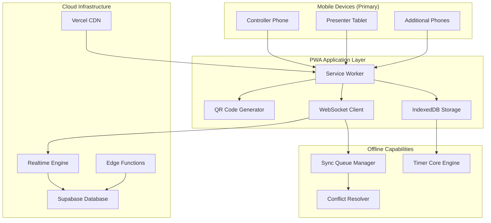

# CueTimer Mobile-First PWA Architecture

**Version:** 1.0
**Date:** October 23, 2024
**Category:** Design → Technical Specifications
**Status:** Ready for Development

---

## Executive Summary

Mobile-first Progressive Web App architecture for CueTimer, prioritizing offline-first reliability, real-time synchronization, and professional performance across all devices.

---

## Technology Stack

### Frontend Architecture
- **Core:** Vanilla JavaScript with Web Components
- **Build Tool:** Vite for fast development and optimization
- **CSS:** Custom properties with design system tokens
- **PWA:** Workbox for service worker and caching strategies
- **State Management:** IndexedDB for offline storage, WebSockets for real-time sync

### Backend Integration
- **Database:** Supabase (PostgreSQL) for real-time data and auth
- **Real-time:** Supabase Realtime subscriptions
- **Authentication:** Supabase Auth with magic link support
- **API:** RESTful endpoints with Supabase Edge Functions
- **Hosting:** Vercel for global CDN and edge deployment

---

## Mobile-First Architecture Overview



---

## Core Technical Requirements

### 1. Progressive Web App (PWA) Foundation

#### Service Worker Strategy
```javascript
// sw.js - Mobile-first caching strategy
const CACHE_STRATEGIES = {
  // Core app functionality - cache first for reliability
  core: {
    strategy: 'CacheFirst',
    cacheName: 'cuetimer-core-v1',
    urls: [
      '/',
      '/app.html',
      '/js/timer-core.js',
      '/js/offline-manager.js',
      '/css/design-system.css'
    ],
    maxAgeSeconds: 60 * 60 * 24 * 30 // 30 days
  },

  // Real-time data - network first with offline fallback
  realtime: {
    strategy: 'NetworkFirst',
    cacheName: 'cuetimer-api-v1',
    maxAgeSeconds: 60 * 5 // 5 minutes
  },

  // Brand assets - cache first for performance
  assets: {
    strategy: 'CacheFirst',
    cacheName: 'cuetimer-assets-v1',
    maxAgeSeconds: 60 * 60 * 24 * 7 // 7 days
  }
};

// Install event - cache core functionality
self.addEventListener('install', (event) => {
  event.waitUntil(
    caches.open('cuetimer-core-v1')
      .then(cache => cache.addAll(CACHE_STRATEGIES.core.urls))
  );
});
```

#### Mobile-Optimized Manifest
```json
{
  "name": "CueTimer - Professional Stage Timing",
  "short_name": "CueTimer",
  "description": "Mobile-first stage timer with real-time sync",
  "start_url": "/?utm_source=pwa",
  "display": "standalone",
  "background_color": "#FFFFFF",
  "theme_color": "#FF6B35",
  "orientation": "any",
  "categories": ["productivity", "business"],
  "scope": "/",
  "icons": [
    {
      "src": "/icons/icon-72x72.png",
      "sizes": "72x72",
      "type": "image/png"
    },
    {
      "src": "/icons/icon-96x96.png",
      "sizes": "96x96",
      "type": "image/png"
    },
    {
      "src": "/icons/icon-128x128.png",
      "sizes": "128x128",
      "type": "image/png"
    },
    {
      "src": "/icons/icon-144x144.png",
      "sizes": "144x144",
      "type": "image/png"
    },
    {
      "src": "/icons/icon-152x152.png",
      "sizes": "152x152",
      "type": "image/png"
    },
    {
      "src": "/icons/icon-192x192.png",
      "sizes": "192x192",
      "type": "image/png",
      "purpose": "any maskable"
    },
    {
      "src": "/icons/icon-384x384.png",
      "sizes": "384x384",
      "type": "image/png"
    },
    {
      "src": "/icons/icon-512x512.png",
      "sizes": "512x512",
      "type": "image/png",
      "purpose": "any maskable"
    }
  ],
  "splash_pages": null
}
```

### 2. Real-Time Synchronization Engine

#### WebSocket Timer Sync
```javascript
// timer-sync.js - Real-time synchronization
class TimerSyncEngine {
  constructor(sessionId) {
    this.sessionId = sessionId;
    this.supabase = createClient();
    this.localTimer = new LocalTimer();
    this.syncQueue = new SyncQueue();
    this.setupRealtimeSubscription();
  }

  setupRealtimeSubscription() {
    // Subscribe to real-time timer updates
    this.supabase
      .channel(`timer:${this.sessionId}`)
      .on('postgres_changes',
        {
          event: 'UPDATE',
          schema: 'public',
          table: 'timers',
          filter: `id=eq.${this.sessionId}`
        },
        (payload) => this.handleRemoteUpdate(payload.new)
      )
      .subscribe();

    // Subscribe to session events
    this.supabase
      .channel(`session:${this.sessionId}`)
      .on('postgres_changes',
        {
          event: '*',
          schema: 'public',
          table: 'session_events'
        },
        (payload) => this.handleSessionEvent(payload)
      )
      .subscribe();
  }

  async handleRemoteUpdate(timerData) {
    // Update local timer with server state
    const localState = this.localTimer.getState();

    if (this.shouldAcceptRemoteUpdate(localState, timerData)) {
      await this.localTimer.updateState(timerData);
      this.notifyUIUpdate(timerData);
      this.checkWarningStates(timerData);
    }
  }

  async sendLocalUpdate(operation) {
    // Optimistic update
    this.localTimer.applyOperation(operation);
    this.notifyUIUpdate(this.localTimer.getState());

    // Queue for sync if offline
    if (!navigator.onLine) {
      await this.syncQueue.addOperation(operation);
      return;
    }

    // Send to server immediately if online
    try {
      await this.syncToServer(operation);
    } catch (error) {
      // Queue for retry if sync fails
      await this.syncQueue.addOperation(operation);
    }
  }
}
```

#### Conflict Resolution Strategy
```javascript
// conflict-resolver.js - Handle competing updates
class ConflictResolver {
  constructor() {
    this.lastServerTimestamp = null;
  }

  shouldAcceptRemoteUpdate(localState, remoteState) {
    // Accept if remote update is newer
    if (remoteState.updated_at > localState.lastUpdated) {
      return true;
    }

    // Handle specific conflict scenarios
    switch (localState.status) {
      case 'running':
        // If local is running, prioritize local control
        return remoteState.status !== 'running';
      case 'paused':
        // Accept remote pause if we're not actively controlling
        return true;
      case 'stopped':
        // Always accept remote start/stop
        return true;
      default:
        return true;
    }
  }

  mergeStates(localState, remoteState) {
    // Intelligent state merging
    return {
      ...remoteState,
      // Preserve local adjustments when reasonable
      duration: this.resolveDuration(localState, remoteState),
      // Use most recent timestamp
      updated_at: Math.max(localState.updated_at, remoteState.updated_at)
    };
  }
}
```

### 3. Offline-First Architecture

#### IndexedDB Storage Schema
```javascript
// offline-storage.js - Client-side data persistence
class OfflineStorage {
  constructor() {
    this.dbName = 'CueTimerOffline';
    this.version = 1;
    this.db = null;
  }

  async init() {
    return new Promise((resolve, reject) => {
      const request = indexedDB.open(this.dbName, this.version);

      request.onerror = () => reject(request.error);
      request.onsuccess = () => {
        this.db = request.result;
        resolve(this.db);
      };

      request.onupgradeneeded = (event) => {
        const db = event.target.result;

        // Store for active timers
        const timerStore = db.createObjectStore('timers', { keyPath: 'id' });
        timerStore.createIndex('sessionId', 'sessionId', { unique: false });
        timerStore.createIndex('lastUpdated', 'lastUpdated', { unique: false });

        // Store for queued operations
        const operationStore = db.createObjectStore('operations', { keyPath: 'id' });
        operationStore.createIndex('timestamp', 'timestamp', { unique: false });
        operationStore.createIndex('synced', 'synced', { unique: false });

        // Store for user settings
        db.createObjectStore('settings', { keyPath: 'key' });

        // Store for session cache
        const sessionStore = db.createObjectStore('sessions', { keyPath: 'sessionId' });
        sessionStore.createIndex('expiresAt', 'expiresAt', { unique: false });
      };
    });
  }
}
```

#### Sync Queue Manager
```javascript
// sync-queue.js - Operation queuing for offline scenarios
class SyncQueue {
  constructor(storage) {
    this.storage = storage;
    this.isProcessing = false;
    this.maxRetries = 3;
  }

  async addOperation(operation) {
    const queuedOp = {
      id: this.generateId(),
      ...operation,
      timestamp: Date.now(),
      synced: false,
      retries: 0
    };

    await this.storage.add('operations', queuedOp);

    if (navigator.onLine && !this.isProcessing) {
      await this.processQueue();
    }

    return queuedOp.id;
  }

  async processQueue() {
    if (this.isProcessing) return;

    this.isProcessing = true;

    try {
      const unsynced = await this.storage.getAllByIndex('operations', 'synced', false);

      for (const operation of unsynced) {
        if (operation.retries >= this.maxRetries) {
          await this.markAsFailed(operation);
          continue;
        }

        try {
          await this.syncToServer(operation);
          await this.markAsSynced(operation);
        } catch (error) {
          await this.incrementRetry(operation);
          break; // Stop on first failure
        }
      }
    } finally {
      this.isProcessing = false;
    }
  }

  async syncToServer(operation) {
    const response = await fetch('/api/sync', {
      method: 'POST',
      headers: {
        'Content-Type': 'application/json',
        'Authorization': `Bearer ${await this.getAuthToken()}`
      },
      body: JSON.stringify(operation)
    });

    if (!response.ok) {
      throw new Error(`Sync failed: ${response.statusText}`);
    }

    return response.json();
  }
}
```

### 4. Mobile-Optimized Timer Engine

#### High-Precision Timer
```javascript
// timer-core.js - Accurate mobile timer implementation
class MobileTimer {
  constructor() {
    this.startTime = null;
    this.pausedTime = 0;
    this.duration = 0;
    this.status = 'stopped'; // stopped, running, paused
    this.updateInterval = null;
    this.callbacks = new Set();
  }

  start(duration) {
    if (this.status === 'running') return;

    this.duration = duration * 1000; // Convert to milliseconds
    this.startTime = performance.now() - this.pausedTime;
    this.status = 'running';

    // Use requestAnimationFrame for smooth updates
    this.scheduleUpdate();
    this.notifyCallbacks();
  }

  pause() {
    if (this.status !== 'running') return;

    this.pausedTime = performance.now() - this.startTime;
    this.status = 'paused';

    if (this.updateInterval) {
      cancelAnimationFrame(this.updateInterval);
      this.updateInterval = null;
    }

    this.notifyCallbacks();
  }

  stop() {
    this.startTime = null;
    this.pausedTime = 0;
    this.status = 'stopped';

    if (this.updateInterval) {
      cancelAnimationFrame(this.updateInterval);
      this.updateInterval = null;
    }

    this.notifyCallbacks();
  }

  scheduleUpdate() {
    this.updateInterval = requestAnimationFrame(() => {
      this.update();

      if (this.status === 'running') {
        this.scheduleUpdate();
      }
    });
  }

  update() {
    const elapsed = performance.now() - this.startTime;
    const remaining = Math.max(0, this.duration - elapsed);

    this.notifyCallbacks({
      remaining: Math.ceil(remaining / 1000),
      elapsed: Math.ceil(elapsed / 1000),
      progress: 1 - (remaining / this.duration),
      status: this.status
    });

    // Auto-stop when timer reaches zero
    if (remaining <= 0 && this.status === 'running') {
      this.stop();
      this.notifyCallbacks({ completed: true });
    }
  }

  getState() {
    if (this.status === 'stopped') {
      return { status: 'stopped', remaining: this.duration / 1000 };
    }

    if (this.status === 'paused') {
      return {
        status: 'paused',
        remaining: Math.ceil((this.duration - this.pausedTime) / 1000)
      };
    }

    if (this.status === 'running') {
      const elapsed = performance.now() - this.startTime;
      const remaining = Math.max(0, this.duration - elapsed);

      return {
        status: 'running',
        remaining: Math.ceil(remaining / 1000),
        elapsed: Math.ceil(elapsed / 1000)
      };
    }
  }
}
```

### 5. QR Code Join System

#### Mobile QR Generation
```javascript
// qr-join.js - Frictionless presenter join system
class QRCodeJoinManager {
  constructor() {
    this.baseUrl = window.location.origin;
  }

  generateSessionQR(sessionId, options = {}) {
    const joinUrl = `${this.baseUrl}/join/${sessionId}`;

    // Mobile-optimized QR code with brand colors
    const qrOptions = {
      width: options.size || 200,
      margin: 2,
      color: {
        dark: '#2D3748',  // Professional Gray
        light: '#FFFFFF'
      },
      errorCorrectionLevel: 'H' // High reliability for mobile scanning
    };

    return {
      qrDataUrl: this.generateQRCode(joinUrl, qrOptions),
      joinUrl,
      sessionId,
      expiresAt: options.expiresAt || (Date.now() + 24 * 60 * 60 * 1000) // 24 hours
    };
  }

  async generateBrandedQR(sessionId) {
    const joinUrl = `${this.baseUrl}/join/${sessionId}`;

    // Create branded QR with CueTimer logo
    const qrOptions = {
      width: 240,
      margin: 2,
      color: {
        dark: '#FF6B35',  // Spotlight Orange
        light: '#FFFFFF'
      },
      errorCorrectionLevel: 'H'
    };

    const qrDataUrl = await this.generateQRWithLogo(joinUrl, {
      ...qrOptions,
      logo: '/icons/cuetimer-logo-small.png',
      logoSize: 48,
      logoMargin: 6,
      logoBackground: '#FFFFFF',
      logoCornerRadius: 8
    });

    return {
      qrDataUrl,
      joinUrl,
      sessionId,
      branded: true
    };
  }

  createJoinLink(sessionId, presenterName = null) {
    const params = new URLSearchParams();
    if (presenterName) {
      params.append('presenter', presenterName);
    }

    const joinUrl = `${this.baseUrl}/join/${sessionId}`;
    return params.toString() ? `${joinUrl}?${params.toString()}` : joinUrl;
  }
}
```

#### Join Flow Handler
```javascript
// join-flow.js - Mobile-optimized presenter join experience
class JoinFlowHandler {
  constructor() {
    this.params = new URLSearchParams(window.location.search);
    this.sessionId = this.extractSessionId();
  }

  extractSessionId() {
    const pathParts = window.location.pathname.split('/');
    return pathParts[pathParts.length - 1];
  }

  async handleJoin() {
    try {
      // Show loading state
      this.showLoadingState();

      // Validate session
      const session = await this.validateSession(this.sessionId);

      if (!session) {
        this.showError('Session not found or expired');
        return;
      }

      // Create presenter session
      const presenterSession = await this.createPresenterSession({
        sessionId: this.sessionId,
        presenterName: this.params.get('presenter') || 'Presenter',
        userAgent: navigator.userAgent,
        timestamp: Date.now()
      });

      // Initialize presenter view
      this.initializePresenterView(presenterSession);

    } catch (error) {
      console.error('Join flow error:', error);
      this.showError('Failed to join session');
    }
  }

  async validateSession(sessionId) {
    const response = await fetch(`/api/sessions/${sessionId}/validate`);
    if (!response.ok) return null;
    return response.json();
  }

  initializePresenterView(session) {
    // Fullscreen presenter experience
    if (this.requestFullscreen()) {
      document.documentElement.requestFullscreen();
    }

    // Initialize timer display
    const timerDisplay = new PresenterTimerDisplay(session);
    timerDisplay.mount(document.body);

    // Hide loading, show timer
    this.hideLoadingState();
  }

  requestFullscreen() {
    // Check if fullscreen is supported and available
    return document.fullscreenEnabled ||
           document.webkitFullscreenEnabled ||
           document.mozFullScreenEnabled ||
           document.msFullscreenEnabled;
  }
}
```

---

## Mobile Performance Optimization

### Critical Performance Targets
- **First Contentful Paint:** < 1.5 seconds on 3G
- **Time to Interactive:** < 3 seconds on mobile
- **Timer Sync Latency:** < 500ms for real-time updates
- **Offline Timer Accuracy:** < 100ms drift per hour
- **Bundle Size:** < 250KB gzipped for core functionality

### Mobile-Specific Optimizations

#### Touch Interaction Optimization
```css
/* Mobile touch targets - 44px minimum */
.ct-touch-target {
  min-height: 44px;
  min-width: 44px;
  padding: 12px;
  /* Prevent zoom on tap */
  touch-action: manipulation;
  /* Smooth touch feedback */
  -webkit-tap-highlight-color: rgba(255, 107, 53, 0.2);
}

/* Large thumb-friendly controls */
.ct-primary-control {
  min-height: 60px;
  min-width: 120px;
  font-size: 18px;
  /* Haptic feedback on supported devices */
  -webkit-touch-callout: none;
}
```

#### Viewport and Safe Area Handling
```css
/* Mobile viewport optimization */
.ct-mobile-container {
  /* Safe area support for notched devices */
  padding-top: env(safe-area-inset-top);
  padding-bottom: env(safe-area-inset-bottom);
  padding-left: env(safe-area-inset-left);
  padding-right: env(safe-area-inset-right);

  /* Prevent bounce scrolling on iOS */
  overscroll-behavior: contain;

  /* Optimize for touch scrolling */
  -webkit-overflow-scrolling: touch;
}

/* Fullscreen presenter view */
.ct-presenter-fullscreen {
  height: 100vh;
  width: 100vw;
  overflow: hidden;
  /* Prevent accidental zoom */
  touch-action: none;
  user-select: none;
}
```

#### Battery and Performance Optimization
```javascript
// performance-manager.js - Mobile performance optimization
class MobilePerformanceManager {
  constructor() {
    this.isLowPowerMode = false;
    this.batteryLevel = 1.0;
    this.setupPerformanceMonitoring();
  }

  async setupPerformanceMonitoring() {
    // Monitor battery level if available
    if ('getBattery' in navigator) {
      const battery = await navigator.getBattery();
      this.batteryLevel = battery.level;
      this.isLowPowerMode = battery.level < 0.2;

      battery.addEventListener('levelchange', () => {
        this.batteryLevel = battery.level;
        this.isLowPowerMode = battery.level < 0.2;
        this.adjustPerformanceMode();
      });
    }

    // Monitor network conditions
    if ('connection' in navigator) {
      const connection = navigator.connection;
      this.adjustForNetworkConditions(connection);

      connection.addEventListener('change', () => {
        this.adjustForNetworkConditions(connection);
      });
    }
  }

  adjustPerformanceMode() {
    if (this.isLowPowerMode) {
      // Reduce animation frequency
      this.setAnimationFrequency(30); // 30fps instead of 60fps
      // Increase sync intervals
      this.setSyncInterval(2000); // 2 seconds instead of 500ms
      // Reduce background processing
      this.setBackgroundProcessing(false);
    } else {
      // Full performance mode
      this.setAnimationFrequency(60);
      this.setSyncInterval(500);
      this.setBackgroundProcessing(true);
    }
  }

  adjustForNetworkConditions(connection) {
    const { effectiveType, saveData } = connection;

    if (saveData || effectiveType === 'slow-2g' || effectiveType === '2g') {
      // Reduce data usage
      this.setSyncInterval(5000); // 5 seconds
      this.disableHighFrequencyUpdates(true);
      this.reduceImageQuality(true);
    } else if (effectiveType === '3g') {
      this.setSyncInterval(2000); // 2 seconds
      this.disableHighFrequencyUpdates(false);
    } else {
      // 4g or better - full performance
      this.setSyncInterval(500);
      this.disableHighFrequencyUpdates(false);
    }
  }
}
```

---

## Mobile Testing Strategy

### Device Coverage Matrix
- **Small Phones:** iPhone SE (375×667), Android Mini (360×640)
- **Standard Phones:** iPhone 12 (390×844), Pixel 5 (393×851)
- **Large Phones:** iPhone 12 Pro Max (428×926), Galaxy S21 (384×854)
- **Tablets:** iPad (768×1024), Galaxy Tab (800×1280)
- **Hybrid Devices:** Surface Duo, foldable phones

### Mobile Testing Scenarios
1. **Core Timer Functions** (start, pause, stop, adjust)
2. **Real-time Sync** (multiple devices, network drops)
3. **Offline Mode** (airplane mode, reconnection)
4. **QR Code Scanning** (camera permissions, different lighting)
5. **Touch Interactions** (thumb reach, gesture conflicts)
6. **Performance** (low battery, poor network)
7. **Accessibility** (screen readers, voice control)

### Automated Mobile Testing
```javascript
// mobile-tests.js - Mobile-specific test scenarios
describe('Mobile Timer Functionality', () => {
  beforeEach(async () => {
    await page.emulate(iPhone);
    await page.goto('/');
  });

  test('Large touch targets work reliably', async () => {
    const playButton = await page.locator('[data-testid="play-button"]');

    // Test touch target size (minimum 44px)
    const box = await playButton.boundingBox();
    expect(box.width).toBeGreaterThanOrEqual(44);
    expect(box.height).toBeGreaterThanOrEqual(44);

    // Test touch interaction
    await playButton.tap();
    await expect(page.locator('[data-testid="timer-display"]')).toBeVisible();
  });

  test('Offline functionality works on mobile', async () => {
    // Start timer
    await page.tap('[data-testid="play-button"]');

    // Simulate offline mode
    await page.setOffline(true);

    // Timer should continue running
    const initialTime = await page.locator('[data-testid="timer-display"]').textContent();
    await page.waitForTimeout(2000);
    const laterTime = await page.locator('[data-testid="timer-display"]').textContent();

    expect(initialTime).not.toBe(laterTime);
  });

  test('QR code is scannable on mobile', async () => {
    await page.tap('[data-testid="create-session"]');

    const qrCode = await page.locator('[data-testid="qr-code"]');
    await expect(qrCode).toBeVisible();

    // Test QR code size (minimum 200px for reliable scanning)
    const box = await qrCode.boundingBox();
    expect(box.width).toBeGreaterThanOrEqual(200);
    expect(box.height).toBeGreaterThanOrEqual(200);
  });
});
```

---

## Implementation Roadmap

### Phase 1: Core Mobile PWA (Weeks 1-4)
1. **PWA Foundation** - Service worker, mobile manifest, caching
2. **Mobile Timer Core** - Touch-optimized controls, accurate timing
3. **Basic Real-time Sync** - WebSocket integration for mobile devices
4. **QR Code Join** - Mobile-optimized join flow
5. **Mobile Auth** - Magic link authentication for mobile

### Phase 2: Offline Mobile Features (Weeks 5-8)
1. **Mobile Offline Storage** - IndexedDB optimization for mobile
2. **Sync Queue** - Mobile-optimized offline operation queuing
3. **Battery Optimization** - Adaptive performance based on battery level
4. **Network Adaptation** - Performance adjustment for network conditions

### Phase 3: Professional Mobile Features (Weeks 9-12)
1. **Advanced Mobile UI** - Gesture controls, haptic feedback
2. **Multi-device Mobile** - Phone + tablet workflows
3. **Mobile Analytics** - Usage tracking and performance monitoring
4. **Mobile Optimization** - Performance tuning for target devices

---

## Success Metrics

### Technical Performance Metrics
- **PWA Installation Rate:** > 40% of mobile users
- **Offline Usage:** > 60% of sessions include offline period
- **Timer Accuracy:** < 100ms drift over 1 hour
- **Sync Success Rate:** > 99% sync success when online
- **Mobile Load Time:** < 2 seconds on 3G networks

### User Experience Metrics
- **Touch Target Success:** > 95% first-touch accuracy
- **QR Code Scan Success:** > 90% successful scans on first attempt
- **Mobile Session Duration:** Average 15+ minutes per session
- **Multi-device Usage:** > 50% of sessions use 2+ devices
- **Return Usage:** > 60% weekly active user retention

---

**Related Documents:**
- [Design System](../branding/design-system.md)
- [UI Guidelines](../ui-ux/user-interface-guidelines.md)
- [System Architecture](./system-architecture.md)
- [Mobile Testing Guide](../../development/guides/mobile-testing.md)

---

**Architecture Ownership:** Web Development Team
**Next Review:** Sprint planning and mobile testing results
**Approval Status:** Ready for Mobile-First Development